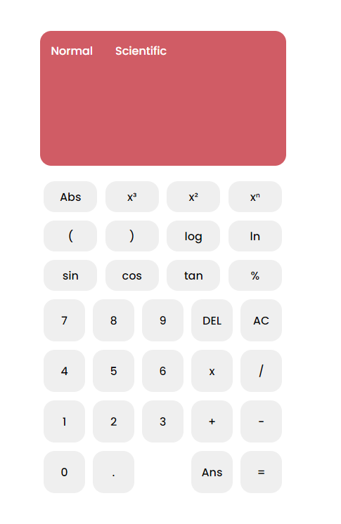

# Web-Scientific-Calculator
A scientific calculator made using HTML, CSS, and Basic JavaScript. Complete with basic to advanced calculator features like history and scientific buttons.

## Features
### Basic Arithmetic
Operations such as addition, subtraction, multiplication, and division are available, alongside detecting errors like divide by zero. Calculator also support decimals and long calculations in a normal order of precedence.

### Scientific Operators
Operations such as logarithm, trigonometric functions, modulo, exponents, and square root are supported. Features such as the ability to see parenthesis suggestions and support for multi-nested operations (still in development) are available.

### (Later Development) History
Keeps track of previous expressions and quickly add them to the calculator display when needed!

### Minimalist UI
A friendly, but intuitive user interface, suited for casual and power users.

## Changelog
Beta 2.0
- Adds Parenthesis and Logarithm Feature
- Adds Nested Expressions (Ability to evaluate nested expressions are still in development)
- Fixed Bugs and Minor Improvements

Beta 3.0 
- Math.js library is integrated in the program
- Ability to solve basic arithmetic and scientific operations, alongside nested expressions

## Screenshots
